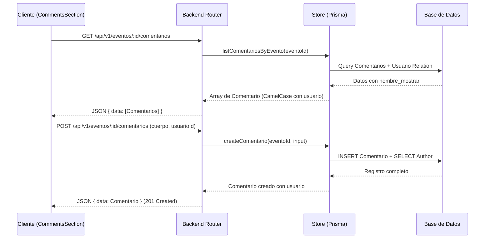

# Especificación de Diseño: Funcionalidad de Comentarios Modulares

**Fecha:** 6 de Julio, 2026  
**Objetivo:** Diseñar e implementar el sistema de comentarios para eventos, integrando cambios en backend (carga de identidades de usuarios vía Prisma) y frontend (componente modular y auto-contenido `<CommentsSection />`).

---

## 🏗️ Arquitectura y Flujo de Datos



---

## 1. 🖥️ Cambios en el Backend

### 1.1 Modelo e Interfaz de Datos (`backend/src/store.ts`)

Actualizaremos la interfaz `Comentario` para contener opcionalmente los datos del autor:

```typescript
export interface Comentario {
  id: string;
  eventoId: string;
  usuarioId: string | null;
  padreId: string | null;
  cuerpo: string;
  creadoEn: string;
  actualizadoEn: string;
  usuario?: {
    id: string;
    nombreMostrar: string;
  } | null;
}
```

### 1.2 Mapeo (`backend/src/store.ts`)

Ajustaremos `mapComentario` para extraer y mapear la relación:

```typescript
const mapComentario = (c: any): Comentario => ({
  id: c.id,
  eventoId: c.evento_id,
  usuarioId: c.usuario_id,
  padreId: c.padre_id,
  cuerpo: c.cuerpo,
  creadoEn: c.creado_en.toISOString(),
  actualizadoEn: c.actualizado_en.toISOString(),
  usuario: c.usuario
    ? {
        id: c.usuario.id,
        nombreMostrar: c.usuario.nombre_mostrar,
      }
    : null,
});
```

### 1.3 Consultas (`backend/src/store.ts`)

Modificaremos las funciones de base de datos para cargar la relación `usuario` mediante Prisma:

- **`listComentariosByEvento`**:

  ```typescript
  export const listComentariosByEvento = async (eventoId: string): Promise<Comentario[]> => {
    const data = await prisma.comentario.findMany({
      where: { evento_id: eventoId },
      include: { usuario: true },
      orderBy: { creado_en: 'asc' },
    });
    return data.map(mapComentario);
  };
  ```

- **`createComentario`**:
  ```typescript
  export const createComentario = async (
    eventoId: string,
    input: CreateComentarioInput
  ): Promise<Comentario | null> => {
    try {
      const data = await prisma.comentario.create({
        data: {
          evento_id: eventoId,
          cuerpo: input.cuerpo,
          usuario_id: input.usuarioId ?? null,
          padre_id: input.padreId ?? null,
        },
        include: { usuario: true },
      });
      return mapComentario(data);
    } catch {
      return null;
    }
  };
  ```

---

## 2. 🎨 Cambios en el Frontend

### 2.1 API Service (`web/src/services/comentarioService.ts`)

- **Corregir Payload en `createComentario`**: Alinear claves con DTOs de Backend.
- **Añadir `deleteComentario`**:
  ```typescript
  export async function deleteComentario(id: string) {
    await api.delete(`/comentarios/${id}`);
  }
  ```

### 2.2 Componente Modular `<CommentsSection />` (`web/src/Components/events/CommentsSection.tsx`)

Este componente será completamente independiente y encapsulará:

- **Estado e Inputs**: El texto del nuevo comentario.
- **Queries y Mutations**:
  - `useQuery(['comments', eventId])` para cargar los comentarios.
  - `useMutation` para agregar un comentario (invalida la caché del listado).
  - `useMutation` para borrar un comentario (invalida la caché del listado).
- **Renderizado**:
  - Lista de comentarios con formato de fecha amigable.
  - Avatares basados en la inicial del nombre del usuario.
  - Botón de eliminación visible únicamente si el `usuarioId` del comentario coincide con el del usuario autenticado actual.
  - Formulario de creación disponible solo si hay una sesión activa.

### 2.3 Integración (`web/src/Pages/EventPage/EventPage.tsx`)

El archivo de detalles del evento simplemente importará y renderizará el componente al pie del contenido:

```tsx
import CommentsSection from '../../Components/events/CommentsSection';

// Al final de la página del evento:
<CommentsSection eventId={data.id} />;
```

---

## 🛡️ Control de Errores y Validaciones

1. **Validación de entrada**: Se deshabilitará el botón "Publicar" si el comentario está vacío o solo contiene espacios.
2. **Control de Borrado**: El backend validará que la petición sea exitosa y el frontend manejará el refresco de forma inmediata.
3. **Control de Sesión**: Si se expira la sesión o el token es inválido, el frontend evitará que se envíen peticiones que resulten en `401 Unauthorized` ocultando el formulario de comentarios y mostrando el prompt de login.
